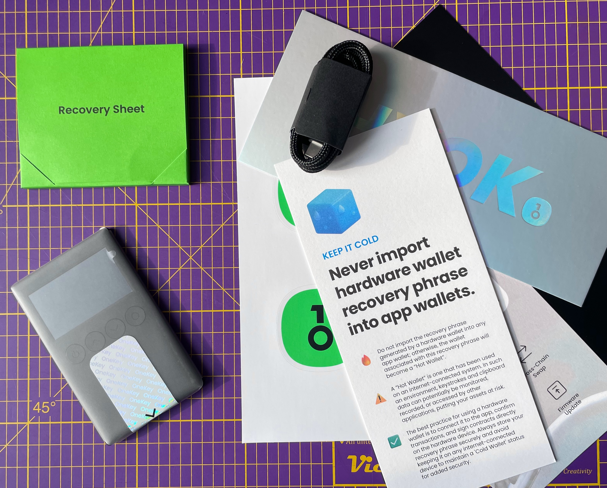

import LinkPreviewStatic from "../components/LinkPreviewStatic.astro";

Investing in cryptocurrency can easily become a daunting task, and securing it even more so. For those who are entirely new, it can be hard to know where to start. The first thing to consider is where to keep your cryptocurrency, and there are a few important things to think about before you get started.

To break it down, there are two types of crypto wallets: **Custodial** and **Non-custodial**. Think of the two as your bank and your wallet, respectively.

## Your "Bank", Their Funds

Custodial wallets regularly come in the form of a currency exchange and generally provide the same core features: your crypto balances and a range of options for buying, selling, and trading.

While these exchanges have appeal in terms of simplicity, they often have tradeoffs. Getting started with an exchange usually requires identity verification, and exchanges often restrict who can use them based on nationality or residency because of local regulations.

The biggest risk with exchanges is that you do not control the keys to your funds. If the exchange is hacked, goes bankrupt, or experiences an outage, you could lose access to your crypto or even lose it entirely.

## Your "Wallet", Your Funds

Non-custodial wallets give you complete control of your crypto with no intermediaries involved. They come in two forms: **hot wallets** and **cold wallets**. Think of them as your everyday wallet and a safe where you keep valuables.

Hot wallets make it easy to use your crypto quickly, whether you want to buy or sell funds, trade on the go, or do more. They're connected to the internet, run on your mobile device, and often have the ability to back them up to iCloud or similar and/or restore them should you lose access.

While this might sound appealing since you're now in full control of your crypto, you wouldn't keep all your money in your everyday wallet.

### Keeping It Cold

This is where cold wallets come in: they're offline or disconnected from the internet, require a PIN or other verification methods to transfer funds, and require physical access to use. Cold wallets can come in a couple of forms: a paper wallet, where the keys to your wallet exist solely on the piece of paper and any copies you may have, or hardware wallets, which are physical devices that you connect to your computer with a cable or use wirelessly via Bluetooth or other communication methods.

These devices provide strong security and resistance to hacking. The keys to your wallet exist entirely in a secure element on the device and on recovery codes, which you write down after setting one up. These recovery codes are essentially the only way someone could gain access to your funds if they got their hands on your hardware wallet, so storing them securely is incredibly important. Think of your recovery code as the combination to your safe. You wouldn't put it on a sticky note stuck to the front of it.

### Your "Safe"

_**Disclaimer**: OneKey sent me the **OneKey Classic 1S** free of charge. No money changed hands, and the opinions in this piece are entirely my own. If you wish to get your own hardware wallet I may earn a commission if you purchase one through my affiliate link [onekey.so/r/MIRSHKO/shop](https://onekey.so/r/MIRSHKO/shop)._

An example of a cold wallet is the [OneKey Classic 1S](https://onekey.so/products/onekey-classic-1s-series/?r=MIRSHKO), a small, secure, and easy-to-use hardware wallet that supports essentially every cryptocurrency you'd want to get started investing in.

While most hardware wallets are created equal, insofar as they have a secure element that keeps your keys safe and a screen you can interact with the device through, the OneKey Classic 1S is quite a nice one.

The form factor is the size of a couple of stacked credit cards, with four buttons, a small monochrome screen, and a USB-C port on the bottom, all built out of a sturdy plastic with a nice soft-touch feeling. The USB-C port can be used for connecting it to your computer and charging the built-in battery so you can use it wirelessly with your phone or computer via Bluetooth using the OneKey App.

When compared with other hardware wallets on the market, the device and companion app are rock solid. Almost all hardware wallets have their own companion apps offering different features to bridge the gap between the services offered by an exchange and the security and peace of mind that come with hardware wallets.

<LinkPreviewStatic
  url="https://help.onekey.so/en/articles/11461095-get-started-with-onekey-classic"
  metadata={{
    title: "OneKey Help Center",
    description: "Get started with OneKey Classic",
    image:
      "https://downloads.intercomcdn.com/i/o/vbbj4ssb/725253/76c20821e332e4da99563a9fc616/23224a18e3844b5af558c03e5d228fd5.png",
  }}
/>

Once you've got set up with the OneKey Classic 1S, the [OneKey App](https://app.onekey.so/r/MIRSHKO/app/defi) or [OneKey browser extension](https://chromewebstore.google.com/detail/onekey-secure-crypto-wall/jnmbobjmhlngoefaiojfljckilhhlhcj) gives you access to many of the same tools you'd have on traditional investment platforms and custodial exchanges. When you first get started investing in cryptocurrency and wish to start putting your funds to work earning for you, using the [OneKey DeFi Earn](https://app.onekey.so/r/MIRSHKO/app/defi) feature is a good first step. You deposit a desired amount of a supported cryptocurrency and earn interest on your deposit, often with significantly higher interest rates than offered by banks. The best part of using a hardware wallet and physically owning your own funds is that you can pick and choose how to make the best use of them. There are no banks to hold your deposits for a year or more at a time, restrict how often you can withdraw from your deposit, or do anything of the sort.

Investing always includes a level of risk, and one of the best ways to reduce that risk is to hold your assets yourself and keep them in a safe place.

I hope this little introduction is a good starting point for your crypto investing journey, and I'd love to hear from you if you found it helpful. Feel free to message me on [BlueSky](https://bsky.app/profile/mirshko.bsky.social) or [send me an email](mailto:email@reiner.systems).
